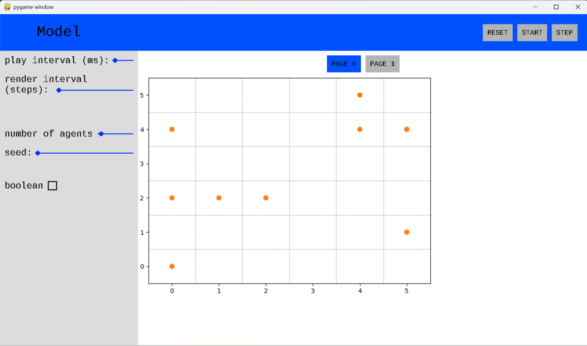

# MesaGraphics: A Mesa Add-on for Pygame-Based Visualization

MesaGraphics is a visualization add-on for Mesa: https://Mesa.readthedocs.io/stable. It is inspired by Mesa's 
Solara-based visualization. The API closely mirrors Mesa's Solara-based visualization API, but runs entirely locally 
through Pygame.



## Why MesaGraphics?

MesaGraphics provides a local visualization backend for Mesa models.

Compared to Solara-based visualization:

- No web browser required
- Runs entirely locally through Pygame
- Simple migration path from existing Solara visualizations
- Suitable for desktop applications and teaching environments

## Table of Contents

1. [Installation](#installation)
2. [Tutorial](#tutorial)
   1. [Prerequisites](#prerequisites)
   2. [Basic Model](#basic-model)
   3. [Important note for MesaGraphics users](#important-note-for-mesagraphics-users)
   4. [Grid Visualization](#grid-visualization)
   5. [Components Visualization](#components-visualization)
   6. [User Parameters](#user-parameters)
   7. [Custom Method Calls](#custom-method-calls)
3. [Solara -> MesaGraphics migration tutorial](#migration-tutorial)

## Installation

### Requirements

- Mesa 3.5.1
- Pygame 2.6.1+

### Install Mesa 3.5.1

Detailed installation instructions are available [here](https://Mesa.readthedocs.io/stable/). 
Use Mesa 3.5.1.

To install the latest stable Mesa release, run:

```bash
pip install mesa
```

You need also networkx, altair, matplolib and solara:

```bash
pip install networkx altair matplotlib solara
```

### Install pygame 2.6.1 or later
 
```bash
pip install pygame
```
Use Pygame 2.6.1 or later.

### Install MesaGraphics

Start by cloning the repository in your project folder 
```bash
cd projectFolder
git clone --filter=blob:none --sparse https://github.com/Erocr/mesa_graphics.git
cd mesa_graphics
git sparse-checkout set mesa_graphics
```
This command clone only the part of the repository with the source code.  
If git is not installed on your computer, or you have problems, you can go directly on 
[the github page](https://github.com/Erocr/mesa_graphics), then click on the green Code button, download ZIP, and 
extract the ZIP file in your project folder.

## Tutorial

The visualization works very similarly to the Mesa's one. In fact, MesaGraphics was designed to make migration from 
Solara visualizations as straightforward as possible. In most cases, migrating an existing visualization only requires 
updating imports and removing Solara-specific decorators.

You can find tutorials for the Solara visualization [here](https://mesa.readthedocs.io/stable/getting_started.html).

We propose the same tutorial, but for our library.

### Prerequisites

This is a tutorial that explain the visualization of mesa's models, and not how mesa work. So, start by taking a look 
of the Mesa's tutorial to understand how mesa work. It is recommended to do this tutorials first :
- [Creating Your First Model](https://mesa.readthedocs.io/stable/tutorials/0_first_model.html)
- [AgentSet](https://mesa.readthedocs.io/stable/tutorials/1_agentset.html)
- [Agent Activation](https://mesa.readthedocs.io/stable/tutorials/2_agent_activation.html)
- [Adding Space](https://mesa.readthedocs.io/stable/tutorials/4_adding_space.html)
- [Collecting Data](https://mesa.readthedocs.io/stable/tutorials/5_collecting_data.html)

We will continue using the models created in this chapters

### Basic Model

This includes importing of dependencies needed for the tutorial.

```python
import mesa
from mesa.discrete_space import CellAgent, OrthogonalMooreGrid

# Check Mesa version for visualization compatibility
if mesa.__version__.startswith(("3.0", "3.1", "3.2")):
    print(
        f"⚠️  Mesa {mesa.__version__} detected. Visualization features require Mesa 3.3+"
    )
    print("To upgrade: pip install --upgrade mesa")

from mesa_graphics import MesaGraphics, make_plot_component
from mesa.visualization import SpaceRenderer
from mesa.visualization.components import AgentPortrayalStyle

# Needed for custom components
from mesa_graphics import FigureMatplotlib
from matplotlib.figure import Figure
```

The following is the basic model we will be using to build the dashboard. This is the same model seen in tutorials 0-3 
of mesa.

```python
def compute_gini(model):
    agent_wealths = [agent.wealth for agent in model.agents]
    x = sorted(agent_wealths)
    N = model.num_agents
    B = sum(xi * (N - i) for i, xi in enumerate(x)) / (N * sum(x))
    return 1 + (1 / N) - 2 * B


class MoneyAgent(CellAgent):
    """An agent with fixed initial wealth."""

    def __init__(self, model, cell):
        """initialize a MoneyAgent instance.

        Args:
            model: A model instance
        """
        super().__init__(model)
        self.cell = cell
        self.wealth = 1

    def move(self):
        """Move the agent to a random neighboring cell."""
        self.cell = self.cell.neighborhood.select_random_cell()

    def give_money(self):
        """Give 1 unit of wealth to a random agent in the same cell."""
        cellmates = [a for a in self.cell.agents if a is not self]

        if cellmates:  # Only give money if there are other agents present
            other = self.random.choice(cellmates)
            other.wealth += 1
            self.wealth -= 1

    def step(self):
        """do one step of the agent."""
        self.move()
        if self.wealth > 0:
            self.give_money()


class MoneyModel(mesa.Model):
    """A model with some number of agents."""

    def __init__(self, n=10, width=10, height=10, rng=None):
        """Initialize a MoneyModel instance.

        Args:
            N: The number of agents.
            width: width of the grid.
            height: Height of the grid.
        """
        super().__init__(rng=rng)
        self.num_agents = n
        self.grid = OrthogonalMooreGrid((width, height), random=self.random)

        # Create agents
        MoneyAgent.create_agents(
            self,
            self.num_agents,
            self.random.choices(self.grid.all_cells.cells, k=self.num_agents),
        )

        self.datacollector = mesa.DataCollector(
            model_reporters={"Gini": compute_gini}, agent_reporters={"Wealth": "wealth"}
        )
        self.datacollector.collect(self)

    def step(self):
        """do one step of the model"""
        self.agents.shuffle_do("step")
        self.datacollector.collect(self)
```

### Important note for MesaGraphics users

When using **MesaGraphics**, Mesa models must be instantiated **using keyword arguments only**. MesaGraphics creates 
model instances internally via keyword-based parameters, and positional arguments are **not supported**.

**Not supported:**

```python 
MyModel(10, 10)
```  
**Supported:**

```python
MyModel(width=10, height=10)
```  
**Common Pitfall:**

When converting from positional to keyword arguments, make sure to include ALL parameters. For example:

```python
model=MoneyModel(100,10,10) #n=100, width=10, height=10

# Correct conversion (keyword)
model = MoneyModel(n=100, width=10, height=10)  # All parameters included

# Incorrect conversion (missing n)
model = MoneyModel(width=10, height=10)  # Defaults to n=10
```
To avoid errors, it is recommended to define your model constructor with keyword-only arguments, for example:

```python
class MyModel(Model):
    def __init__(self, *, width, height, rng=None):
        ...
```


### Adding visualization

So far, we’ve built a model, run it, and analyzed some output afterwards. However, one of the advantages of agent-based 
models is that we can often watch them run step by step, potentially spotting unexpected patterns, behaviors or bugs, 
or developing new intuitions, hypotheses, or insights. Other times, watching a model run can explain it to an 
unfamiliar audience better than static explanations. MesaGraphics allows you to create an 
interactive visualization of the model. In this section we’ll walk through creating a visualization using built-in 
components, and (for advanced users) how to create a new visualization element.

First, a quick explanation of how MesaGraphics interactive visualization works. The visualization is done locally with 
pygame. To run it, you need to call the code of MesaGraphics. In fact, executing the function MesaGraphics() runs create
automatically the window.

### Grid Visualization

Mesa’s grid visualizer works by iterating over each cell in the grid and generating a portrayal for every agent it 
finds. The portrayal function is called for each agent and returns an AgentPortrayalStyle—an object that defines how 
the agent is visually represented.

All you need to provide is a function that takes an agent as input and returns an AgentPortrayalStyle.

Here’s the simplest example: it draws each agent as a filled orange circle with a radius of 50.

``` python
def agent_portrayal(agent):
    return AgentPortrayalStyle(color="tab:orange", size=50)
```

In addition to the portrayal method, we instantiate the model parameters, some of which are modifiable by user inputs. 
In this case, the number of agents, N, is specified as a slider of integers.

``` python
model_params = {
    "n": {
        "type": "SliderInt",
        "value": 50,
        "label": "Number of agents:",
        "min": 10,
        "max": 100,
        "step": 1,
    },
    "width": 10,
    "height": 10,
}
```
Next, we instantiate the visualization object which (by default) displays the grid containing the agents, and 
timeseries of values computed by the model’s data collector. In this example, we specify the Gini coefficient.

There are 3 main buttons (we will discuss the play interval, render interval and use threads in lesson 6):

- **the step button**, which advances the model by 1 step
- **the play button**, which advances the model indefinitely until it is paused
- **the pause button**, which pauses the model

To reset the model :

1. Update the parameters (e.g. move the sliders)  
2. Press reset

### Components Visualization

The right part of the screen contains the components. Components are views that shows what is happening in runtime. 
They can be plots, spaces, or even custom components, made by the user.

#### SpaceRenderer

This is the Python object used to visualize the grid, agents, and property layers associated with the space and the 
model and is passed to the `MesaGraphics` function. It is considered as a component in the 0-th page. 

We initialize the SpaceRenderer with a model instance (e.g., `money_model` in this case) and specify the rendering 
backend. The available backends are `matplotlib`(default) and `altair` (not implemented yet).

Both backends can be extended using the post_process function, which can either be passed directly to the render() 
method or set as a property of the renderer. (We’ll cover this in more detail later.)

The method shown here is the quickest way to set up the visualization using the `render()` function.

It renders the space, agents, and property layers—provided that the corresponding portrayal functions are supplied for 
both agents and property layers.

> Note:
> You can make the small window full screen by clicking the button in the top-right corner of the bar.

#### Plot Components

You can place different components (except the renderer) on separate pages according to your preference. Pages do not 
need to be sequential or positive, but having more than 30 pages can create less confortable interface. Each page acts 
as an independent window where components may or may not exist.

The default page is page=0. If pages are not sequential (e.g., page=1 and page=10), the system will automatically 
create the 8 empty pages in between to maintain consistent indexing. To avoid empty pages in your dashboard, use 
sequential page numbers.

To assign a plot component to a specific page, pass the page keyword argument to make_plot_component. For example, the 
following will display the plot component on page 1:

``` python
plot_comp = make_plot_component("encoding", page=1)
```

#### Custom Components

If you want a custom component to appear on a specific page, you must pass it as a tuple containing the component and 
the page number.

Now we add our custom component. In this case we will build a histogram of agent wealth.

Besides the standard matplotlib code to build a histogram, please notice that :
1. you need to use the FigureMatplotlib function from MesaGraphics, it transforms the plot in pygame.Surface.
2. you must initialize a figure using this method instead of plt.figure(), for thread safety purpose
```python
def Histogram(model):
    # Note: you must initialize a figure using this method instead of
    # plt.figure(), for thread safety purpose
    fig = Figure()
    ax = fig.subplots()
    wealth_vals = [agent.wealth for agent in model.agents]
    # Note: you have to use Matplotlib's OOP API instead of plt.hist
    # because plt.hist is not thread-safe.
    ax.hist(wealth_vals, bins=10)
    return FigureMatplotlib(fig)
```

> Note :  
> Your custom component function can be any function that take the model and returns a pygame.Surface. If you know 
> pygame, you can have fun making complicated stuff. 

Now we create the model and initialize the visualization

```python
# Create initial model instance
money_model = MoneyModel(n=50, width=10, height=10)

SpaceGraph = make_space_component(agent_portrayal)
GiniPlot = make_plot_component("Gini", page=1)

page = MesaGraphics(
    money_model,
    components=[SpaceGraph, GiniPlot, (Histogram, 2)],
    model_params=model_params,
    name="Boltzmann Wealth Model",
)
```

### User Parameters

Above we gave an example of user parameters definition :
`````python
model_params = {
    "n": {
        "type": "SliderInt",
        "value": 50,
        "label": "Number of agents:",
        "min": 10,
        "max": 100,
        "step": 1,
    },
    "width": 10,
    "height": 10,
}
`````

Actually, you have a lot more choices. You have :
- SliderInt: slider with integers. The parameters are **value / label / min / max / step**
- SliderFloat: slider with floats. The parameters are **value / label / min / max / step**
- CheckBox: a box that can be checked (True) or empty (False). The parameters are **value / label**
- Select: a drop-down button that permit to chose between multiple possibilities. The parameters are **value / label / values**
- InputText: A box where user can write text. The parameters are **value / label**

### Custom Method Calls

This feature does not exist in mesa.visualization. It allows users to modify the Model during runtime. It is useful in 
order to debug you program for example.

We will continue with the previous model (MoneyModel). We start by adding a method `tax` into MoneyModel :
```python
class MoneyModel(mesa.Model):
   ...
   
   
    def tax(self, amount=1):
        for agent in self.agents:
            agent.wealth = max(0, agent.wealth - amount)
```
This function removes `amount` of money to every agent in the Model.
Then, we specify the parameters (modifiable by the user or not). 
```python
custom_buttons = {
    "tax": {
        "amount": {
            "type": "SliderInt",
            "value": 1,
            "min": 1,
            "max": 5,
            "step": 1
        }
    }
}
```
The syntax is really similar to `model_params`. We associate to each method name the parameters.


## Migration tutorial

If you already have a Mesa program with a Solara based visualization, this part explain how to easily migrate to the 
MesaGraphics visualization.

### Imports

This module use many functions from the mesa.visualization package. Only a few functions are changed in MesaGraphics. 
Though, we kept the same name for a majority of these functions. So, in order to make the migration, just change some 
imports.

Replace the following Solara visualization imports with their MesaGraphics counterparts:
- `create_space_component`
- `make_space_component`
- `make_altair_space`
- `make_mpl_space_component`
- `make_plot_component`
- `make_mpl_plot_component`

Finally, in order to start the visualization, use `MesaGraphics` function instead of `SolaraViz`.

For example, the following imports:
```python
from mesa.visualization import (
    make_plot_component,
    make_space_component,
    SolaraViz
)
from mesa.visualization.user_param import Slider
```
become:
```python
from mesa_graphics import (
    make_plot_component,
    make_space_component,
    MesaGraphics
)
from mesa.visualization.user_param import Slider
```

### Custom visualization components

Custom visualization components are user-defined functions that generate graphical elements.
With Solara, the syntax looks like:
```python
@solara.component
def Histogram(model):
    update_counter.get()  # This is required to update the counter
    # Note: you must initialize a figure using this method instead of
    # plt.figure(), for thread safety purpose
    fig = Figure()
    ax = fig.subplots()
    wealth_vals = [agent.wealth for agent in model.agents]
    # Note: you have to use Matplotlib's OOP API instead of plt.hist
    # because plt.hist is not thread-safe.
    ax.hist(wealth_vals, bins=10)
    solara.FigureMatplotlib(fig)
```


With MesaGraphics, you must not use Solara's functions. You must:
1. remove `@solara.component`, it is no more necessary.
2. remove `update_counter.get()`. It is not mandatory to remove it, but it is not needed in the MesaGraphics 
architecture.
3. Import and use the MesaGraphics function `FigureMatplotlib` instead of the Solara's one. Moreover, you shall return 
the result of the function:
`from mesa_graphics.backend_integration import FigureMatplotlib`

So the function above becomes:
```python
from mesa_graphics.backend_integration import FigureMatplotlib

def Histogram(model):
    # Note: you must initialize a figure using this method instead of
    # plt.figure(), for thread safety purpose
    fig = Figure()
    ax = fig.subplots()
    wealth_vals = [agent.wealth for agent in model.agents]
    # Note: you have to use Matplotlib's OOP API instead of plt.hist
    # because plt.hist is not thread-safe.
    ax.hist(wealth_vals, bins=10)
    return FigureMatplotlib(fig)
```

You can also create your own Pygame-based visualization functions. 
A custom visualization component is simply a function that takes a model as input and returns a `pg.Surface`.

For example:
```python
import pygame as pg

def WhiteComponent(model):
    res = pg.Surface((100, 100))
    res.fill((255, 0, 0))
    return res
``` 
This function is a valid component that draws a red rectangle.

### Summarize

To make the migration from Solara's view to MesaGraphics, follow these steps:
1. Import MesaGraphics functions instead of their mesa.visualization counterparts.
2. Replace SolaraViz with MesaGraphics
3. Change the custom visualization components

### A full example


The following code use Solara to visualize the Boltzmann wealth Model (found in the getting started tutorial of mesa).
This example has a space renderer, a normal plot component, and a custom component.
We added comments to describe what change.
```python
import solara
import mesa
from matplotlib.figure import Figure
from mesa.discrete_space import CellAgent, OrthogonalMooreGrid
from mesa.visualization.utils import update_counter
from mesa.visualization import SolaraViz, SpaceRenderer, make_plot_component
from mesa.visualization.components import AgentPortrayalStyle

""" We change this imports:
import solara                                                                 # to remove
import mesa                                                                   # same
from matplotlib.figure import Figure                                          # same                                         
from mesa.discrete_space import CellAgent, OrthogonalMooreGrid                # same
from mesa.visualization.utils import update_counter                           # can be removed
from mesa_graphics import MesaGraphics, make_plot_component                   # changed
from mesa_graphics import FigureMatplotlib                                    # added (for the custom component)
from mesa.visualization import SpaceRenderer                                  # same
from mesa.visualization.components import AgentPortrayalStyle                 # same
"""

def compute_gini(model):
    agent_wealths = [agent.wealth for agent in model.agents]
    x = sorted(agent_wealths)
    N = model.num_agents
    B = sum(xi * (N - i) for i, xi in enumerate(x)) / (N * sum(x))
    return 1 + (1 / N) - 2 * B


class MoneyAgent(CellAgent):
    """An agent with fixed initial wealth."""

    def __init__(self, model, cell):
        """initialize a MoneyAgent instance.

        Args:
            model: A model instance
        """
        super().__init__(model)
        self.cell = cell
        self.wealth = 1

    def move(self):
        """Move the agent to a random neighboring cell."""
        self.cell = self.cell.neighborhood.select_random_cell()

    def give_money(self):
        """Give 1 unit of wealth to a random agent in the same cell."""
        cellmates = [a for a in self.cell.agents if a is not self]

        if cellmates:  # Only give money if there are other agents present
            other = self.random.choice(cellmates)
            other.wealth += 1
            self.wealth -= 1

    def step(self):
        """do one step of the agent."""
        self.move()
        if self.wealth > 0:
            self.give_money()


class MoneyModel(mesa.Model):
    """A model with some number of agents."""

    def __init__(self, n=10, width=10, height=10, seed=None):
        """Initialize a MoneyModel instance.

        Args:
            N: The number of agents.
            width: width of the grid.
            height: Height of the grid.
        """
        super().__init__(seed=seed)
        self.num_agents = n
        self.grid = OrthogonalMooreGrid((width, height), random=self.random)

        # Create agents
        MoneyAgent.create_agents(
            self,
            self.num_agents,
            self.random.choices(self.grid.all_cells.cells, k=self.num_agents),
        )

        self.datacollector = mesa.DataCollector(
            model_reporters={"Gini": compute_gini}, agent_reporters={"Wealth": "wealth"}
        )
        self.datacollector.collect(self)

    def step(self):
        """do one step of the model"""
        self.agents.shuffle_do("step")
        self.datacollector.collect(self)


def agent_portrayal(agent):
    return AgentPortrayalStyle(color="tab:orange", size=50)


model_params = {
    "n": {
        "type": "SliderInt",
        "value": 50,
        "label": "Number of agents:",
        "min": 10,
        "max": 100,
        "step": 1,
    },
    "width": 10,
    "height": 10,
}

plot_comp = make_plot_component("encoding", page=1)


# Create initial model instance
money_model = MoneyModel(n=50, width=10, height=10)  # keyword arguments

renderer = (
    SpaceRenderer(model=money_model, backend="matplotlib")
    .setup_agents(agent_portrayal)
    .render()
)

GiniPlot = make_plot_component("Gini", page=1)


@solara.component
def Histogram(model):
    update_counter.get()
    fig = Figure()
    ax = fig.subplots()
    wealth_vals = [agent.wealth for agent in model.agents]
    ax.hist(wealth_vals, bins=10)
    solara.FigureMatplotlib(fig)
    
""" We modify the function
# solara.component removed
def Histogram(model):
    update_counter.get()  # Not necessary, can be removed
    fig = Figure()
    ax = fig.subplots()
    wealth_vals = [agent.wealth for agent in model.agents]
    ax.hist(wealth_vals, bins=10)
    return FigureMatplotlib(fig)  # returns the FigureMatplotlib from MesaGraphics
"""


page = SolaraViz(
    money_model,
    renderer,
    components=[GiniPlot, (Histogram, 2)],
    model_params=model_params,
    name="Boltzmann Wealth Model",
)

""" Use MesaGraphics instead of SolaraViz
page = MesaGraphics(
    money_model,
    renderer,
    components=[GiniPlot, (Histogram, 2)],
    model_params=model_params,
    name="Boltzmann Wealth Model",
)
"""
```

