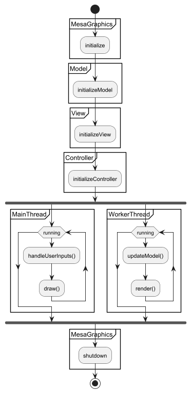
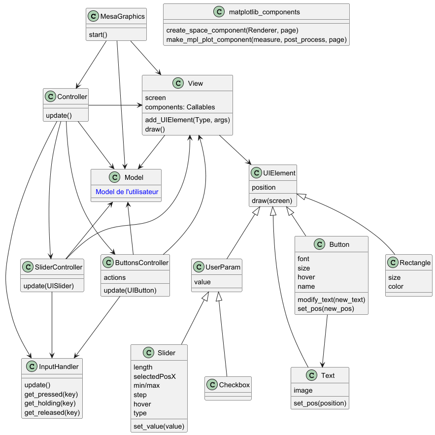

# Developer documentation

This documentation is made for developers who want to contribute the project.
It explains what this project does, and how it does it.

## Features

MesaGraphics is a visualization add-on for Mesa: https://Mesa.readthedocs.io/stable. 

The user define a Mesa Model, then, the MesaGraphics library show the Model, and the user defined plots. It allows the 
user to interact with the Model, and to re-instantiate it through buttons, checkboxes, and sliders.


It is inspired by Mesa's Solara-based visualization. The API closely mirrors Mesa's Solara-based visualization API, but runs 
entirely locally through Pygame.

### Components

Components are dynamic plots keeping track of Model's attributes, and being refreshed every time the user's Model is 
modified.
There are multiple ways to create components :
- Though the Mesa's Renderer (the class name is SpaceRenderer) create the space plots. It shows a grid with the agents 
in it.
- Though the make_plot_component function. This function create a plot keeping track of the value of an attribute
(or the result of a function).
- Custom components, for more complex plots.

These functions are implemented in the components.py file.

Each component is accompanied by the page in which it will be drawn (0 by default). The components are drawn in the 
order chosen by the user when their page is the current selected page.

The user can change the page with buttons.

### Model Parameters

The user can define dynamically chosen model parameters (the elements in the left column in the image). 

When the user click on "RESET", the Model is re-instantiated. 
The parameters chosen to re-instantiate the Model are the one chosen with sliders, or checkboxes.


## Dev environment setup

Start by being sure that you are allowed to contribute. 
If you can't, have the rights, due to any reasons, I give you all rights to copy the code, and paste it in a new 
repository, and add things in it. 

### Installation

In the user's documentation, there is a command line that clone only the folder with the source code, but here you need
all the folders.

```bash
git clone "https://github.com/Erocr/mesa_graphics.git"
```

Install the following requirements : numpy, matplotlib, mesa, networkx, altair, solara, pygame :
```bash
pip install networkx altair matplotlib solara pygame mesa
```

You can verify that all is right installed by executing a test. Try testing with a normal test, and not with a test 
from tests/examples. tests/examples is a folder with migrations from a repository full of examples of mesa, but some of
this examples are not possible to migrate in MesaGraphics.


### Repository structure

The repository has multiplie folders.  
- All code is in the **mesa_graphics** folder.  
- The tests are python files that call our library. They are all in the **tests** folder.  
- In **doc** folder, you have all the documentation files, used for new contributors, and to describe what and how I did 
the library. Some files are only here for my internship.

Finally, there are some files in none of these folders. These files are here for users.


## Conception 

The class MesaGraphics is the starting point of the graphic interface. It starts automatically all the modules which 
will create the window, start the visualization, and start to take account of the user's inputs.

### High Level Architecture

MesaGraphics follow the conception pattern MVC (Model View Controller). So, it has the three main classes :
- Model : Contains the user's Model, and some attributes.
- View : Creates the window, place all the UI elements onto the screen, and handle the logic to show them.
- Controller : Take into account the user's inputs.

### High Level flow

You can see below a graphic representation of the high level flow.



For better performances, we implemented multithreading.

The main thread is really lightweight. It handles the user's inputs, and draw onto the screen. This thread shall be 
really fast to have a responsive interface. It runs currently approximately at 1000 fps.

The worker thread is the one that do all the expensive computations. So, it generates the plots, and simulate the Model.
This two operations can be arbitrary hard because the user can give custom plots and custom Model.

The multithreading can make a lot of subtle bugs really hard to debug. So, when you add code, make attention to some 
points:
- `View.draw` must not draw things depending on the user's Model state. It could draw the Model only half simulated, 
drawing a state of the Model that never exist. If you want to draw things depending on the Model state, please start by 
rendering them in the `View.render` function, and then draw the rendered image. This solves the problem because the 
rendering function and the Model simulation function are in the same thread.
- In general, try using attributes in only one thread. Make attention when some attributes are modified and used in 
different threads.
- Python use GIL : The Python Global Interpreter Lock or GIL, in simple words, is a mutex (or a lock) that allows only 
one thread to hold the control of the Python interpreter. So modifying an attribute in two different threads can be 
acceptable.


## More precise architecture

Below, the complete architecture



### Controller

All the events are handled by InputHandler. This class allow you to directly know if some key is pressed, held, or 
released.  
The Controller is cutted in ButtonsController and UserParamController. The ButtonsController part is responsible for 
the Button actions, while the UserParamController is responsible for modifying the userParam values according to the 
user's inputs.

### UIElement

All the graphical elements are UIElements (except the components).
In the UIElement class, there is only the logic to draw them. The logic to interact with them is in the Controller part.

You can create UIElement through the `View.add_UIElement` function.
The order in which you create UIElements is meaningful. They are drawn in the same order.

### Interacting with buttons

Each Button has a name. This name can be the one chosen, or by default, if none is chosen, the text in it. Each name 
is unique (if it is not, the name is changed so that it is). The ButtonsController part has a dictionary called 
`button_actions` that associate to each button's name the function that will be called once the button is pressed.

The ButtonsController will at each update see if the user is pressing on a button, and if so, he will execute the 
associated function.

### Interacting with UserParam

Interacting with UserParam is pretty similar to interacting with buttons. Each UserParam has a name just as the buttons.
When the user change a UserParam value, the UserParamController call a method of the UserParam to describe the change.
Finally, when the user re-instantiate the Model, the UserParamController iterate through all the UserParam to catch 
their values, and use them as the next Model parameters.


